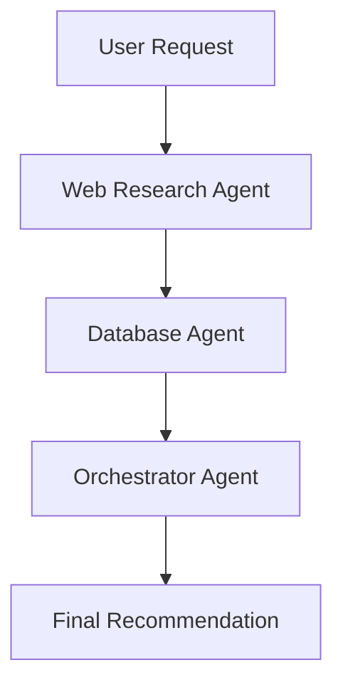
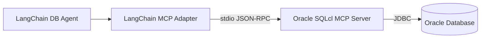
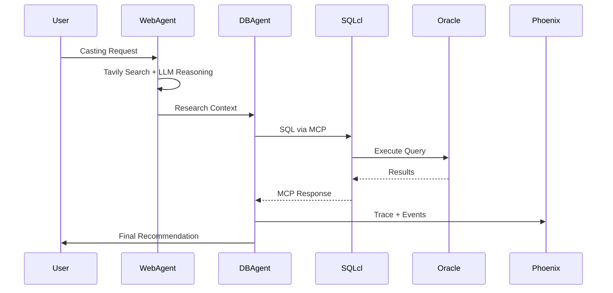

# TalentScout AI

**Resilient, Observable AI Agents with Oracle MCP & OpenTelemetry**

TalentScout AI is a reference implementation of a **production-ready AI agent system**.  
It demonstrates how to safely connect LLM-powered agents to **enterprise databases**, while maintaining **observability, resilience, and security**.

This project focuses less on _what_ the agent recommends and more on _how_ it works under the hood.

----------

## What This Project Demonstrates

 - Multi-agent orchestration using a graph model   
 - Secure databaseaccess via **Model Context Protocol (MCP)**   
 - Graceful failure handling when tools or protocols break
 - End-to-end observability with OpenTelemetry & Phoenix

----------

## 🧠 High-Level Idea

Most AI demos stop at _“the model answered a question.”_  
Real systems need to answer a harder question:

> **What happened when the agent didn’t work?**

TalentScout AI answers that by:

-   Structuring agents as a **graph**
-   Separating web research from enterprise data access
-   Capturing every step as a **trace**, not a print statement
    
----------

## Architecture Overview

### Agent Graph



Each agent has **one responsibility**:

-   **Web Agent** → external context
-   **DB Agent** → internal truth
-   **Orchestrator** → decision logic
    

This keeps the system explainable and debuggable.

----------

## Secure Data Access with MCP

### Why MCP?

Direct database drivers inside agent code create problems:

-   Credentials leak into logs or prompts
-   LLMs gain too much authority
-   Security teams lose visibility

Instead, TalentScout AI uses the **Model Context Protocol (MCP)**.

### MCP Flow




## Component Breakdown

### Web Research Agent

-   Uses Tavily for real-time search
-   Uses a local LLM (Ollama) to interpret results
-   Outputs _context_, not decisions

**Purpose:**

> “What does the outside world say?”

----------

### Database Agent (Oracle 26ai Vector Search)

-   **Native Vector Search**: Uses Oracle 26ai `VECTOR` data type and `VECTOR_DISTANCE` function.
-   **Semantic Querying**: Matches actor "bios" semantically against user requests (e.g., "dark thriller" matches "intense" bio).
-   **Secure Access**: Executes vector queries via Oracle SQLcl MCP Server.

**Purpose:**

> “Who in our roster *feels* right for this role?” (Semantic Match)

----------

### Orchestrator Agent

-   Combines web context + DB results
-   Applies simple business logic
-   Produces the final recommendation

**Purpose:**

> “Given reality and constraints, what should we do?”


## Observability with OpenTelemetry

### One-Line Instrumentation

```python
LangChainInstrumentor().instrument(tracer_provider=tracer_provider)
```

### What Gets Traced

- Agent execution order  
- Web search latency  
- LLM prompts and responses  
- Generated SQL  
- MCP handshake warnings  
- Error recovery paths

### Trace Visualization

All traces are sent to **Arize Phoenix**, allowing you to:

-   Inspect the agent’s “thought process”
-   Debug failures without reproducing them
-   Compare successful vs failed runs

----------

## End-to-End Execution Flow



----------

## Tech Stack
 
 -   **Agent Orchestration:** LangGraph
 -   **LLM Runtime:** Ollama (running `gemma2:9b` & `nomic-embed-text`)
 -   **Web Search:** Tavily
 -   **Enterprise DB:** Oracle Database 26ai (Free Container)
 -   **Secure Access:** Oracle SQLcl MCP Server
 -   **Observability:** OpenTelemetry + Arize Phoenix

----------

## Running the Demo

```bash
python main.py
```

Then open Phoenix:

```text
http://localhost:6006
```

> Agents don’t fail because models are dumb.  
> They fail because systems are invisible.

This project makes agents **visible, explainable, and safe to operate**.

### Screenshots


##### v2


#### v3


